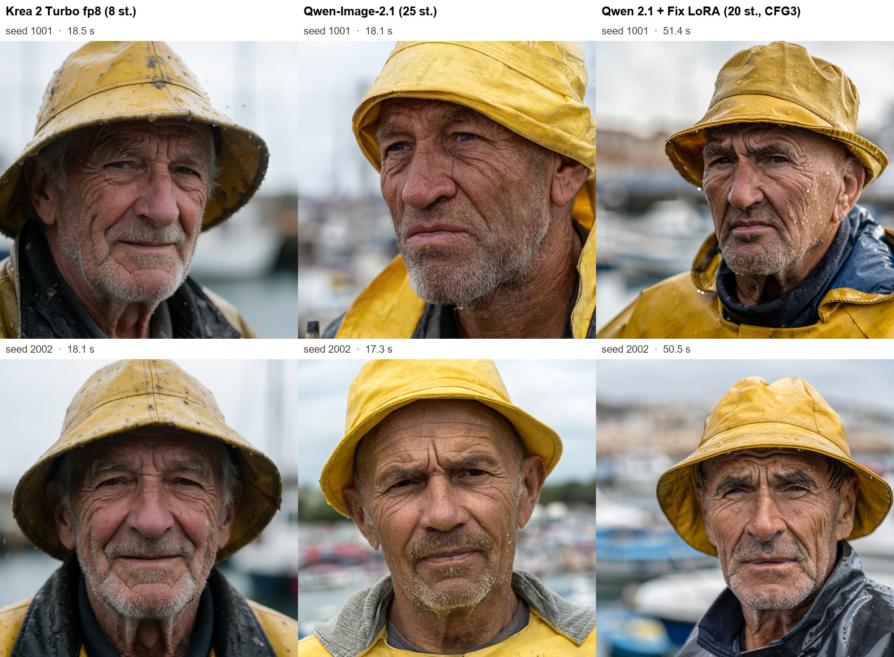
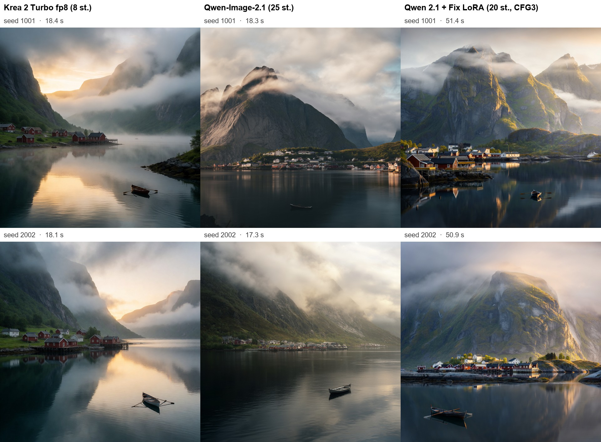
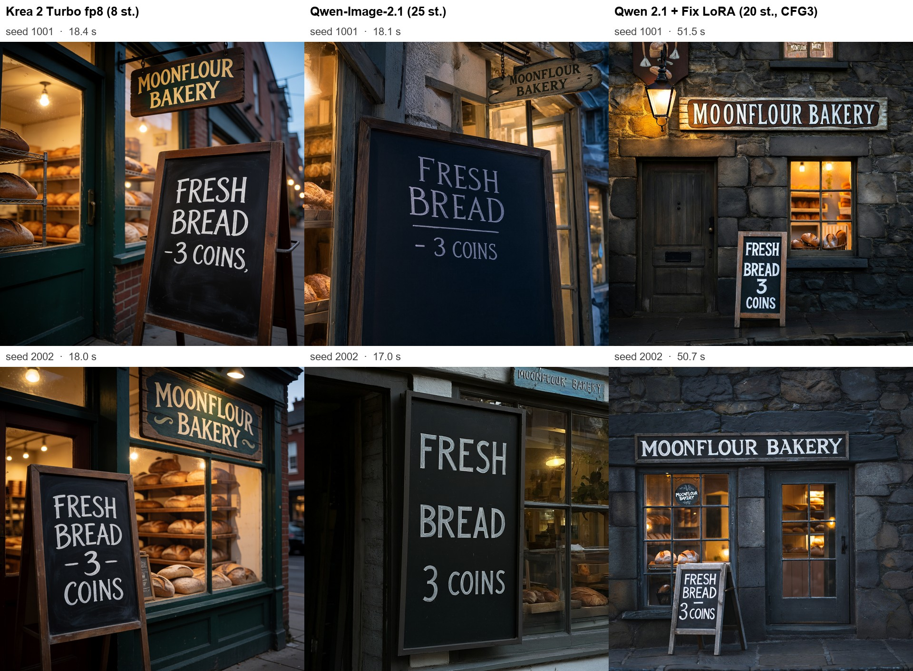
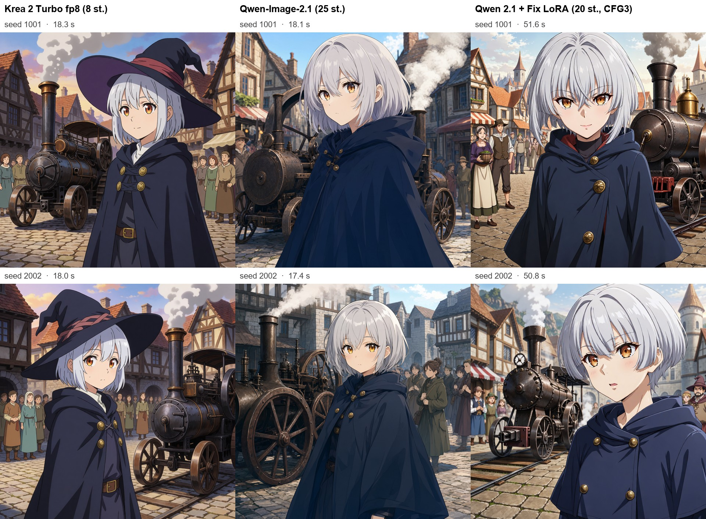
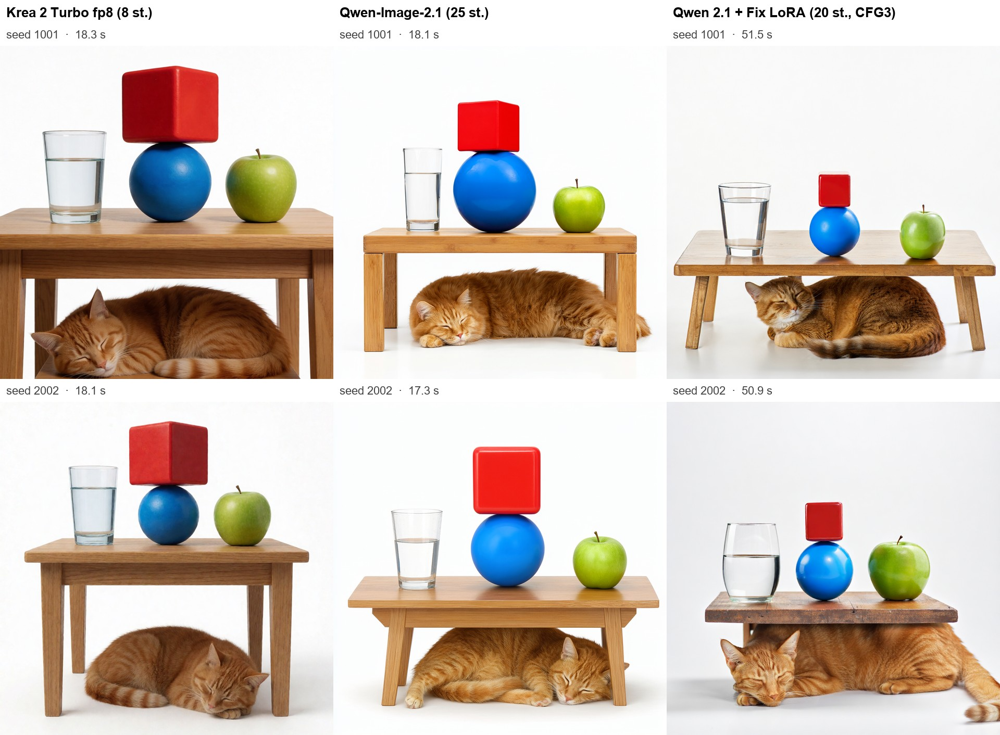
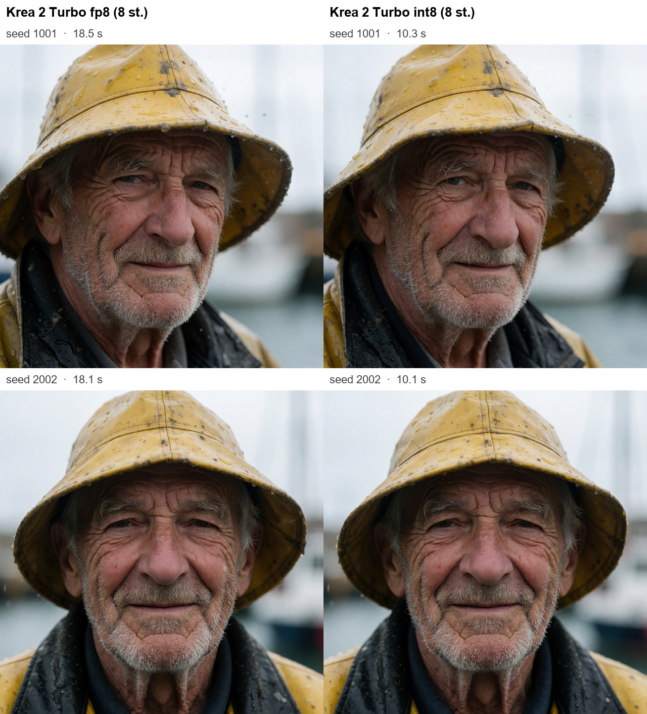

# Krea 2 Turbo vs Qwen-Image-2.1 (+ Fix LoRA) — local text-to-image on one RTX 3090

A small, reproducible head-to-head of the two most-discussed open-weight text-to-image models of autumn 2026, run locally in ComfyUI on a single **RTX 3090 (24 GB, Ampere)**.

- **Krea 2 Turbo** — 12B DiT, 8-step distilled, Qwen3-VL-4B text encoder (fp8 *and* int8 checkpoints tested)
- **Qwen-Image-2.1** — 7B DiT, official ComfyUI template settings
- **Qwen-Image-2.1 + [Fix LoRA](https://huggingface.co/e-n-v-y/Qwen-Image-2.1-Fix)** — community LoRA with the author's recommended sampling recipe

Same 5 prompts × 2 seeds for every variant, 1024×1024, prompt enhancers **off** so every model sees the identical text.

## TL;DR

| | Krea 2 Turbo **int8** | Krea 2 Turbo fp8 | Qwen-Image-2.1 | Qwen-Image-2.1 + Fix LoRA |
|---|---|---|---|---|
| Steps / CFG | 8 / 1 | 8 / 1 | 25 / 1 | 20 / 3 (+APG, FreSca) |
| **Avg time / image (RTX 3090)** | **10.2 s** | 18.2 s | 17.7 s | 51.1 s |
| Realism (portrait) | ★★★ | ★★★ | ★★ | ★★½ |
| Atmosphere / color (landscape) | ★★★ | ★★★ | ★½ | ★★½ |
| Text rendering | ★★½ | ★★½ | ★★½ | ★★★ |
| Anime scene / prompt following | ★★★ | ★★★ | ★★ | ★★½ |
| Multi-object composition | ★★★ | ★★★ | ★★★ | ★★½ |

**Verdict:** for pure text-to-image, **Krea 2 Turbo wins** — most photographic portraits, best light/mood, best anime scene staging. Base Qwen-Image-2.1 looks noticeably flatter and more washed-out. The Fix LoRA closes much of that gap (more contrast, detail, best text layout) but costs ~3× the time. Qwen-Image-2.1 is better positioned as an **editing** model (that's what it's built for), not as a t2i model.

**Use the int8 Krea checkpoint on RTX 30xx.** Ampere has no FP8 tensor cores, so the fp8 checkpoint is upcast every layer; `krea2_turbo_int8_convrot` runs on INT8 tensor cores and is **1.78× faster (18.2 s → 10.2 s)** with visually identical output (see the fp8-vs-int8 sheets).

This lines up with the take in [Aitrepreneur's Qwen Image 2.1 video](https://youtu.be/5Sby8YxbhJc) (Oct 2026): Qwen-Image-2.1 shines at editing, while Krea 2 is the stronger text-to-image model. On the [Artificial Analysis open-weights arena](https://artificialanalysis.ai/image/leaderboard/text-to-image?open-weights=true) Qwen-Image-2.1 currently ranks higher — arena Elo and this small, subjective prompt set measure different things, so try your own prompts.

## Results

### Krea 2 Turbo (fp8) vs Qwen-Image-2.1 vs Qwen-Image-2.1 + Fix LoRA

**Portrait** — Krea looks like an actual photo of an *elderly* man; Qwen's subjects skew younger and slightly plastic; Fix adds contrast and wet-skin detail.


**Landscape** — Krea nails mist + sunrise; base Qwen is flat and grey; Fix is vivid and sharp but loses most of the fog.


**Text** — all three spell both signs correctly; Krea once adds a stray comma; Fix produces the cleanest storefront layout.


**Anime fantasy (original character)** — Krea stages the whole scene (steam engine, crowd, warm light); base Qwen is character-centric and flat; Fix turned the "primitive steam engine" into a rail locomotive.


**Composition** — every variant gets all objects and relations right; Fix squashes the cat under a too-low table in one seed.


### Krea 2 Turbo: fp8 vs int8 (RTX 3090)

| Checkpoint | Size | Avg time / image | Model load |
|---|---|---|---|
| `krea2_turbo_fp8_scaled` | 12.2 GB | 18.2 s | 21 s |
| `krea2_turbo_int8_convrot` | 12.6 GB | **10.2 s** | 11.5 s |


More: [landscape](sheets/landscape_fp8_vs_int8.jpg) · [text](sheets/text_fp8_vs_int8.jpg) · [anime](sheets/anime_fantasy_fp8_vs_int8.jpg) · [composition](sheets/composition_fp8_vs_int8.jpg)

Raw per-image timings: [timings.json](timings.json).

## Setup

- GPU: RTX 3090 24 GB (second GPU, `--cuda-device 1`), 128 GB RAM, Windows 10
- ComfyUI portable, commit `f1072eb0` (2026-10-03) — needed for the native Qwen-Image-2.1 nodes (`TextEncodeQwenImage21`, `QwenImage21Cache`); Krea 2 is native since v0.26
- Timings are wall-clock per queued prompt **after** a warm-up generation (model load excluded), VAE decode included

### Models (all from Hugging Face, SHA256-verified)

| Variant | Files |
|---|---|
| Krea 2 Turbo | [Comfy-Org/Krea-2](https://huggingface.co/Comfy-Org/Krea-2): `krea2_turbo_fp8_scaled` / `krea2_turbo_int8_convrot`, `qwen3vl_4b_fp8_scaled`, `qwen_image_vae` |
| Qwen-Image-2.1 | [Comfy-Org/Qwen-Image-2.1](https://huggingface.co/Comfy-Org/Qwen-Image-2.1): `qwen_image_2.1_int8_convrot`, `qwen3vl_8b_int8_convrot`, `qwen_image_2.1_vae_bf16` |
| Fix LoRA | [e-n-v-y/Qwen-Image-2.1-Fix](https://huggingface.co/e-n-v-y/Qwen-Image-2.1-Fix): `qwen-image-2.1-fix-1.0-comfy` |

### Sampling

| Variant | Graph |
|---|---|
| Krea 2 Turbo | `CLIPTextEncode` → `ConditioningZeroOut` (negative), KSampler 8 steps, CFG 1, euler / simple (official template) |
| Qwen-Image-2.1 | `QwenImage21Cache` → KSampler 25 steps, CFG 1, euler / simple (official template) |
| + Fix LoRA | LoRA 1.0 → `APG` (eta 1, norm 10, momentum 0.3) → `FreSca` (1, 2, 8) → KSampler 20 steps, CFG 3, seeds_2 / sgm_uniform + the author's negative prompt |

## Reproduce

```bash
# start ComfyUI on the GPU you want to test
python main.py --cuda-device 1 --port 8189
# generate every variant x prompt x seed (writes results/ + timings.json)
python scripts/compare.py --port 8189
python scripts/compare.py --port 8189 --only krea2int8
# build the comparison sheets
python scripts/sheets.py krea2,qwen21,qwen21fix sheet
python scripts/sheets.py krea2,krea2int8 fp8_vs_int8
```

`compare.py` expects to live in a folder next to `ComfyUI/` (it moves outputs from `ComfyUI/output/cmp/`). Edit `PROMPTS` to test your own.

## Caveats

- 5 prompts × 2 seeds is a sanity check, not a benchmark — judgements above are subjective.
- Prompt enhancers were disabled for fairness; both official workflows enable one by default and it changes results.
- Only 1024×1024 was tested; Qwen-Image-2.1 natively targets up to 2048×2048 and the Fix LoRA author recommends 1200×1600.
- Model licenses: Krea 2 Community License (gated, content-filter requirement for deployers), Qwen-Image-2.1 per Alibaba's license, Fix LoRA per its author.

Scripts in this repo: MIT.
